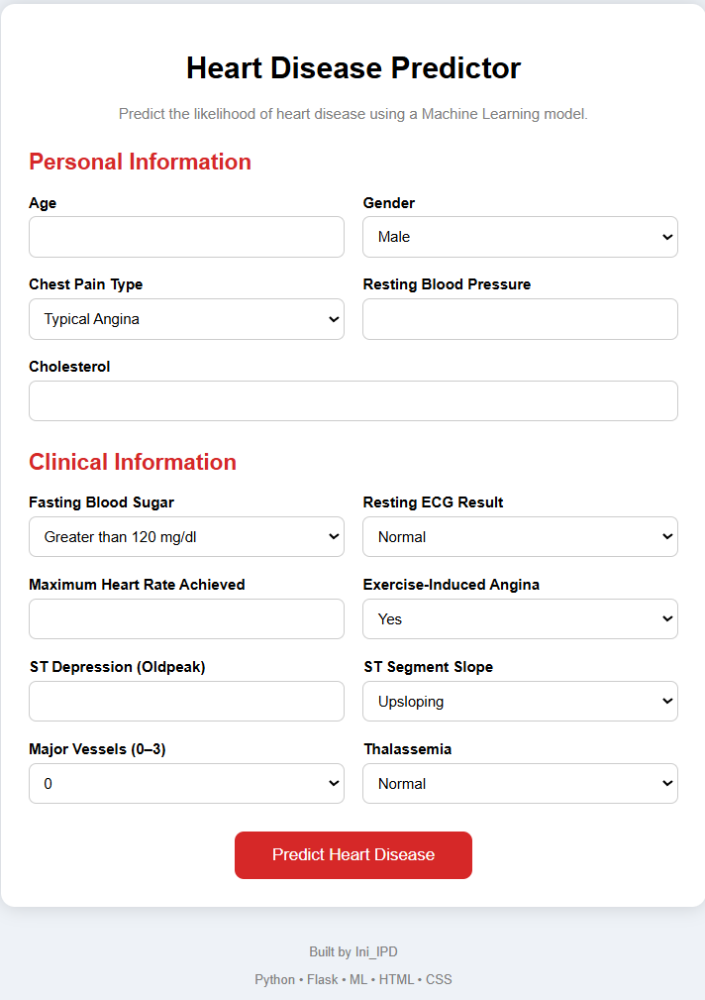
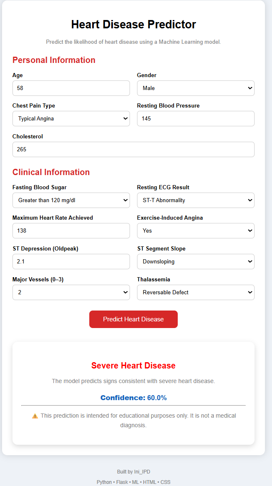

# Heart Disease Prediction
This is a machine learning web application that predicts the severity of heart disease based on patient information. I built this project to get hands-on 
experience with complete machine learning workflow (from data preprocessing, model training to building a web interface and deploying it online).

## HomePage

## Features
- Predicts heart disease severity using a trained KNN model
- Data preprocessing and feature transformation
- Interactive web interface
- Deployed online using Render

## Tech Stack
- Python
- Flask
- Scikit-learn
- Pandas
- NumPy
- HTML
- CSS
- Git & GitHub
- Render

## Machine Learning
I trained and compared four machine learning models:
- Logistic Regression
- Support Vector Machine (SVM)
- K Nearest Neighbors (KNN)
- Random Forest
Among these, KNN gave the best performance on my dataset. So it was used for the final application.

## Live Demo
🔗 https://heart-disease-predictor-t29h.onrender.com

## Prediction Result

## Future Improvements
- Improve the UI
- Include visualizations
- Make the application mobile-friendly
